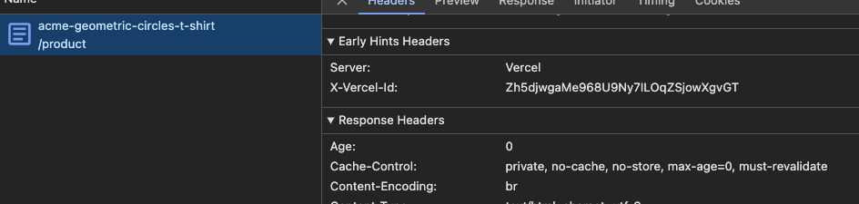
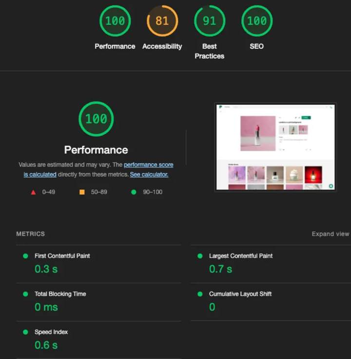

Static Site Generation(SSG)에서 콘텐츠가 늘어날수록 빌드 시간은 기하급수적으로 증가합니다. 특히 상세 페이지의 개수가 늘어날수록 빌드 시간이 15분까지 늘어나면서 개발 경험에 심각한 악영향을 미쳤습니다.

이러한 비효율적인 개발 워크플로우를 개선하기 위해 고심한 끝에 App Router가 제공하는 SSR + 데이터 캐싱 패턴을 활용하여 빌드 시간을 2분까지 줄인 경험을 이야기하고자 합니다.

<!--truncate-->

Next.js pages router에서 제공하는 SSG는 정적 웹 페이지를 생성하는 데 매우 효과적입니다. 특히 Vercel로 Next.js 애플리케이션을 관리하게 된다면, 캐시 정책과 같은 것들을 자동으로 설정해주어 사용자 네트워크 환경에 관계없이 굉장히 빠른 HTML 서빙 속도를 보장할 수 있었습니다.

그래서 저는 app router를 사용하면서도 SSG를 사용했는데요. app router에서 SSG를 사용하는 방법도 역시 간단합니다.

```typescript
// somethings/[somethingId]/page.tsx
export async function generateStaticParams() {
  const response = await fetch("https://.../somethings");

  if (!response.ok) {
    throw new Error();
  }

  // ...

  const somethingIds = somethings.map((something) => {
    return { somethingId: something.id };
  });

  return somethingIds;
}

export default function Page({ params }: { params: { somethingId: string } }) {
  // ...

  return <div>...</div>;
}
```

Next.js의 훌륭한 API 덕분에 개발자 경험도, 사용자 경험도 좋았습니다.

하지만, 마냥 좋기만 했다면 제가 이 글을 작성하지는 않았을 겁니다.

## 문제: 상세 페이지 개수에 비례하여 증가하는 빌드 시간

Static Site Generation(SSG)을 사용하면서 가장 큰 문제는 데이터의 양이 증가함에 따라 빌드 시간이 비례하여 증가하는 것이었습니다.

특히, 생성할 상세 페이지의 개수가 10,000 여개로 증가하자 빌드 시간이 15분까지 늘어났습니다. 이로 인해 개발 주기가 길어지고, 팀원들 간의 협업에 차질이 생기면서 전체적인 개발 경험이 저하되었습니다. 빌드를 기다리는 시간이 많아지니 새로운 기능을 테스트하거나 버그를 수정하는 데 소요되는 시간이 늘어나는 악순환이 발생했습니다.


## 데이터 캐싱 전략으로 해결하기

어떻게 빌드 시간을 줄일 수 있을까 열심히 조사하던 중, [Next.js의 공식문서](https://nextjs.org/docs/app/building-your-application/data-fetching/fetching)와 [Vercel GitHub repo](https://github.com/vercel/commerce)를 찾았습니다.

공식 문서와 Vercel repo는 SSG 없이, fetch API를 이용하여 data caching 하는 기법을 적용하고 있었습니다. [Vercel repo를 통해 운영 중인 웹사이트](https://demo.vercel.store/)를 이용해보니 퍼포먼스가 놀라울 정도로 훌륭했습니다. SSG가 아니라는 점이 상당히 놀라울 정도로.

사실 저는 학생 때, Next.js(pages router)의 SSR을 애플리케이션에 적용해본 적이 있었는데, 너무 좋지 않은 경험을 했기에 Next.js가 제공하는 SSR에 상당히 부정적이었습니다(페이지 로딩 속도가 너무 느렸다).

그런데 SSR로 이런 퍼포먼스를 보여준다는 것이 너무 놀라웠습니다. 의심이 되어 HTTP 응답 헤더를 분석해보았는데, 캐싱이 적용되어있지 않았습니다.



저는 이것을 확인하자마자 대박이라는 생각을 했고, 곧바로 제가 직면한 문제 상황에 대입해보기로 했습니다.

방법은 아주 간단했습니다. SSG 관련 코드를 모두 제거하고, `fetch`에 `force-cache`를 전달해주었습니다.

```typescript
async function getSomething(somethingId: string): Promise<Something | undefined> {
  const response = await fetch(`https://.../somethings/${somethingId}`, {
    // ...
    cache: 'force-cache',
  });

  // ...

  return {
    ...
  };
}

// somethings/[somethingId]/page.tsx
export default function Page({
  params: { somethingId },
}: {
  params: { somethingId: string };
}) {
  const something = await getSomething(somethingId);

  if (!something) {
    return notFound();
  }

  return ...
}
```

위와 같이 데이터 캐싱을 활용하니 빌드 시간이 2분 대로 단축 됐을 뿐만 아니라, HTML 서빙 속도도 SSG와 동일한 성능을 보장할 수 있었습니다.




## 결론

데이터 캐싱 전략의 도입은 저에게 더 효율적인 개발 환경을 제공해주었습니다. 빌드 시간을 15분에서 2분으로 줄이는 것은 물론, SSG와 비슷한 성능을 보장받을 수 있었습니다.

하지만, Next.js가 `fetch` API를 커스텀한 것에 대해서는 부정적인 생각이 들었습니다. 물론 최종적으로는 그것을 받아들였지만요.

그리고 이렇게 좋은 경험을 하는 한 편, 내부에서 어떤 동작이 일어나는지 좀 더 빠삭하게 익혀놓아야 할 필요가 있다는 생각을 하기도 했습니다(기술에 잡아먹히면 안될테니까요).
