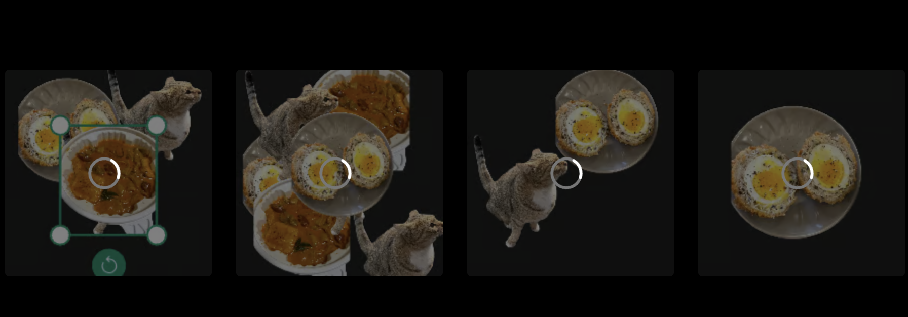

사용자에게 최상의 저장 경험을 제공하기 위한 기술적 고민

<!--truncate-->

저는 최근에 사용자가 페이지를 이탈하려는 순간을 감지하여 사용자 모르게 데이터 저장 API를 호출하는 로직을 개발해야 했어요.
사용자 입장에서는 자동저장이라고 볼 수 있을 것 같아요.

어렵지 않은 일이라고 생각했지만, 이미 구현되어있는 페이지나 컴포넌트간 관심사와 의존성을 고려해야하다보니 기능 추가가 쉽지 않았습니다.

그래서 더 나은 사용자 경험을 제공하기 위해 기술적으로 꽤 많은 고민을 했고, 이번 글에서는 그 기술적 고민들을 이야기합니다.

## `beforeunload` 이벤트와 SPA, MPA

자동 저장 기능 로직을 개발하고자 조사를 진행 하던 중, [beforeunload 이벤트](https://developer.mozilla.org/en-US/docs/Web/API/Window/beforeunload_event)에 대해 알게 되었습니다.

그래서 저는 이 API로 모든 일을 해결할 수 있을 줄 알고 큰 착각을 했어요.
하지만 아쉽게도 `beforeunload` 이벤트는 아래 2가지 문제만 해결해줄 수 있었어요.

1. 페이지 새로고침
2. 페이지 닫기

**페이지 이동**에 대해서는 `beforeunload` 이벤트가 발생하지 않았는데요.

사실 저는 이 이벤트가 왜 발생하지 않는지 한 번에 알아챌 수는 있었는데요.

React나 SPA 형태로 웹 앱 제품을 개발해보신 분이라면 대부분 SPA에서 페이지 이동이 어떻게 이루어지는지 알고 있으실 거에요.

그리고 Next.js App에서도 `<Link>` 컴포넌트를 통한 클라이언트 사이드 라우팅을 지원함으로써 SPA의 새로고침 없이 부드러운 페이지 전환 경험을 제공할 수 있게 도와주고 있어요.

그리고 `<Link>`의 기본 동작은 새 URL을 히스토리 스택에 푸시하는 것이에요. 이 기본 동작에서 알 수 있듯이 `<Link>`를 통한 이동은 웹 서버에 새로운 HTML을 요청하는 것이 아니라 URL에 따라 컴포넌트를 렌더링하는 것(자바스크립트 실행)이에요.

즉 `<Link>`를 통한 페이지 이동은 아래와 같이 MDN에서 설명하는 발동 조건을 만족하지 못해요.

> "beforeunload 이벤트는 window, 문서(document) 및 해당 리소스가 언로드(unload) 되려고 할 때 시작됩니다. 문서는 계속 보이고 있으며 이벤트는 이 시점에서도 취소할 수 있습니다." - [MDN](https://developer.mozilla.org/ko/docs/Web/API/Window/beforeunload_event)

하지만, `<Link>`가 아닌 `<a>`를 사용한다면, 페이지마다 HTML을 생성하는 Next.js App에서는 `beforeunload` 이벤트가 발생하겠네요. 그런데 `<a>`를 사용하게 되면, SPA의 장점인 부드러운 페이지 전환을 포기해야겠죠? 그럼 우리의 제품은 MPA처럼 변할 것입니다. 그리고 페이지 이동시에 HTML,CSS,JS와 같은 리소스들을 웹 서버에 다시 요청해야 할 것이고요.

따라서 제게는 App 내에서 페이지 이동을 감지할 수 있는 장치가 필요했습니다.

## `pathname`과 `resource id`에 의존하는 컴포넌트와 로직, 하지만 아쉬운 의존성 주입

저는 요구사항을 만족하기 위해 페이지 이동하는 "순간"을 감지하여 데이터 저장 API를 호출하고 싶었으나, Next.js App Router부터는 `useRouter()` hook에서 router event를 지원하지 않고 있어요.

그래서 App 내에서 페이지 이동을 감지할 수 있으려면 우선 `pathname`에 의존해야 하는 컴포넌트를 만들어야했어요.

그리고 [Next.js 공식 문서 사례](https://nextjs.org/docs/app/api-reference/functions/use-router#router-events)를 따라 페이지 이동을 감지할 수 있는 컴포넌트를 만들었어요.

```tsx
'use client';

import { useEffect } from 'react';
import { usePathname } from 'next/navigation';

export function ResourceUpdater() {
  const pathname = usePathname();

  useEffect(() => {
    // ...
  }, [pathname]);

  return null;
}
```

하지만 이 컴포넌트는 제가 원하는 페이지가 이동되는 "순간"을 감지할 수는 없어요.

그래서 고민한 결과, 제가 구현하고자 하는 로직이 **이전 페이지**에 의존하는게 좋겠다는 생각을 했어요.

```tsx
'use client';

import { useEffect } from 'react';
import { usePathname } from 'next/navigation';

export function ResourceUpdater() {
  const pathname = usePathname();

  useEffect(() => {
    return () => {
      const previousPage = pathname;

      console.log({ previousPage });
    };
  }, [pathname]);

  return null;
}
```

그리고 이제 `resource id`를 통해 데이터를 저장 API를 호출할 수 있는 로직이 필요했어요. 하지만, 우리의 제품이 당연히 페이지가 하나는 아니겠죠? `/`도 있을 것이고, `/login`, `/sign-up`, `/resources/{resource-id}` 등 많은 페이지가 있을 거에요.

그래서 결국 찝찝하긴 하지만, 아래와 비슷한 코드를 작성하게 됐어요.

```tsx
const { mutate: updateResource } = useUpdateResource({
  onSuccess: (updateResourceResponse) => {
    ...
  },
  onError: (apiServerErrorResponse) => {
    ...
  }
});

useEffect(() => {
  return () => {
    if (pathname.startsWith(Pathname.RESOURCE)) {
      // pathname은 반드시 `/resources/{resource-id}`일 것이라고 가정한다.
      const resourceId = pathname.split('/')[2];

      updateResource(resourceId, {
        ...resource,
        foo: 1,
        bar: 2,
      });
    }
  };
}, [pathname]);
```

그런데 저는 `<ResourceUpdater>`라는 컴포넌트 이름이 `resourceId`를 prop으로 받지 않는 것이 조금 찝찝했고, `useUpdateResource()`에 `resourceId`를 인자로 전달하지 않는 것도 조금 마음에 걸렸고요.

특히 `useUpdateResource()`에 `resourceId`를 전달하지 못할 경우, 어떤 resource에 대해 `mutating`하고 있는지 알 수 없었기 때문에, `resource-id`에 의존하는 UI에 현재 데이터가 저장 중이라는 표시를 할 수 없었기에 더욱 아쉬움이 남았어요.

```tsx
// bad😭
const isResourceUpdating =
  useIsMutating({
    mutationKey: [UPDATE_RESOURCE_MUTATION_KEY],
  }) > 0;

// good😊
const isResourceUpdating =
  useIsMutating({
    mutationKey: [UPDATE_RESOURCE_MUTATION_KEY, resourceId],
  }) > 0;

if (isResourceUpdating) {
  return <p>updating...</p>;
}

return <div>...</div>;
```

만약 위와 같이 코드를 작성하게 되면, `resourceId`에 관계 없이 아래 사진처럼 `isResourceUpdating`에 의존하는 모든 UI에 로딩이 표시될 것이라 상당히 아쉬운 구현이었습니다.


## 페이지 이동 이벤트에 대해 다루는 컴포넌트에서 이벤트 핸들링 하기

먼저 이전 페이지가 리소스 페이지인지 안전하게 확인하기 위하여 `usePreviousPage`, `useIsPreviousPageResource`를 만들었어요.

```ts
function usePreviousPage() {
  const pathname = usePathname();
  const [previousPage, setPreviousPage] = useState<string | null>();

  useEffect(() => {
    return () => {
      setPreviousPage(pathname);
    };
  }, [pathname]);

  return previousPage;
}
```

```ts
function useIsPreviousPageResource(previousPage: string | null) {
  if (!previousPage) {
    return false;
  }

  return previousPage.startsWith(Pathname.RESOURCE);
}
```

그리고 `resourceId`를 파싱할 수 있게 `getResourceIdFromPathname`을 만들어주었습니다.

```ts
function getResourceIdFromPathname(pathname: string) {
  // pathname은 반드시 `/resources/{resource-id}`일 것이라고 가정한다.
  const resourceId = pathname.split('/')[2];

  return resourceId;
}
```

그리고 이렇게 아래와 같이 `<ResourceUpdater>`에 `resourceId`를 주입할 수 있게 해주었어요.

```tsx
function NavigationEvents() {
  const currentPage = usePathname();
  const previousPage = usePreviousPage();
  const isPreviousPageResource = useIsPreviousPageResource(previousPage);

  useEffect(() => {
    ...
  }, [currentPage])

  if (isPreviousPageResource) {
    const resourceId = getResourceIdFromPathname(previousPage);

    return <ResourceUpdater resourceId={resourceId}>;
  }

  return null;
}
```

이로써 `useUpdateProject`에 인자로 `resourceId`를 전달할 수 있게 됐고, `mutationKey`를 완전히 유일하게 만들어 줌으로써 비동기 처리 상태에 대해 문제를 해결해줄 수 있었어요. 하지만 여전히 무언가 많이 부족해보여서 여전히 고민거리로 남아있는 기능입니다.
