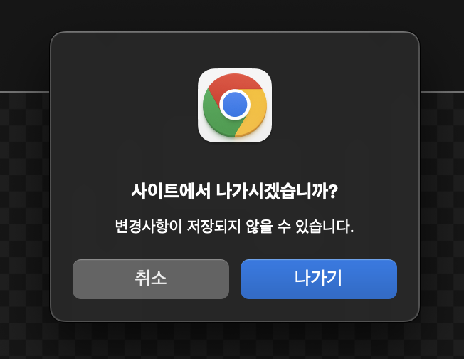
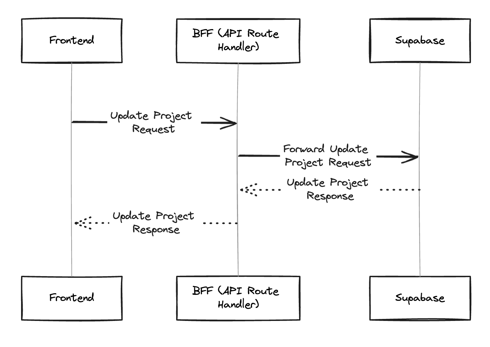

BFF, XHR, Service Worker, 그리고 IndexedDB까지 사용해본 이야기

<!--truncate-->

## 배경

최근 프로젝트 데이터 저장에 대한 개선 요청사항이 들어왔었다. 페이지를 끄거나, 새로고침 할 때 발생하는 경고 표시가 안떴으면 좋겠다는 것이었다.



이유는 모니터링 결과, 사용자들이 경고 문구를 제대로 읽지 않는다는 것이었다. 그리고 경고 문구를 잘 읽고, 페이지에 머무르더라도 UI상 저장버튼이 존재하지 않아서 사용자들이 저장에 대해 헤메이기도 한다고 한다.

가장 쉬운 방법은 저장 버튼을 추가하는 것이겠지만, 여차저차 하다보니 그 대신에 새로고침, 닫기시에 경고를 표시하지 않고도 저장이 보장되는 것을 구현하는 방향으로 흘렀다.

### 페이지 이탈 경고 표시를 해야했던 이유: HTTP 요청

기존 방식에서 `beforeunload` 이벤트를 이용하여 페이지 이탈 경고를 표 했던 이유가 있다. 서버 데이터와 클라이언트 데이터 사이의 차이가 있다면, 그것을 서버에 저장해야 했기 때문이다. 그런데 `beforeunload` 이벤트는 `Promise` 를 기다려주지 않는다.

그래서 사용자가 페이지를 닫거나 새로고침 하려고 할 경우 일단 경고를 표시한 후, 사용자의 결정에 따라 API를 요청하는 방식으로 개발이 되어있었다.

그러나 이 케이스의 경우, JSON 뿐만 아니라 File도 실어서 HTTP 요청을 수행해야했기 때문에 그 속도는 꽤나 느렸고, 이 때문에 바로 페이지를 닫거나 새로고침을 할 수 없었기에 사용자 경험에 좋지 않은 영향을 줬다.

## 문제를 해결하기 위한 시도들

위에서 정의한 배경과 문제를 해결하기 위해 여러가지 시도들을 해보았다.

### 시도 1: fetch API의 keepalive 활용하기

일단 팀에서는 Supabase JS SDK를 사용하고 있기 때문에 `keepalive` 를 쓸 수 없었다. 그래서 Next.js의 API Route Handler를 `BFF` 서버처럼 활용하여 다음과 같은 방식을 고안했다.


```typescript
// app/api/projects/[projectId]
export async function PUT(request: NextRequest) {
  ...
  const {
    data: updatedProject,
    error: updateProjectError,
  } = await supabase.from('projects').update(...)
  ...

  return NextResponse.json(...);
}
```

그리고 FE에서는 BFF 서버로 HTTP 요청을 수행하는데, 이 때 `keepalive` 를 활성화한다.

```typescript
...
fetch(`/api/projects/${projectId}`, {
  method: 'PUT',
  keepalive: true,
  ...
});
...
```

위 아이디어는 API 요청이 성공적으로 잘 수행 됐지만, 새로고침시 프로젝트에 대한 캔버스 내용과 썸네일 이미지가 동기화되지 않는 문제가 발생했다.
그 이유는 서버에서는 아직 이미지 업로드를 처리하지 못했기 때문에, 이전 이미지의 URL을 참조하기 때문이다. 그래서 이 방법으로는 문제를 해결할 수 없었다.

### 시도 2: beforeunload 이벤트에서 동기 XHR 요청

동기 XHR 요청은 브라우저의 UI 스레드를 차단하기 때문에 사용자가 페이지를 떠나려고 할 때 눈에 띄는 지연이 발생할 수 있다. 결국 이는 사용자 경험 저하로 이어지고, 내가 풀고자 하는 문제를 해결할 수 없다.

### 시도 3: Service Worker

사용자가 페이지를 떠난 후에도 안정적으로 API를 호출하기 위한 방법으로 아래와 같이 Service Worker도 이용해봤다.

```typescript
useBeforeUnload(() => {
  canvasToImageFile((imageFile) => {
    navigator.serviceWorker.controller.postMessage({
      type: 'UPDATE_PROJECT',
      project,
      imageFile,
    });
  });

  return false; // 페이지 이탈 경고 표시를 하지 않겠다.
});
```

로컬 환경에서는 완벽하게 작동하는 것처럼 보였다.

하지만 배포 환경에서 테스트를 해보니 종종 Service Worker로 메시지가 전달되지 않는 것이 확인 됐다. 그도 그럴 것이 `canvasToImageFile` 은 비동기 함수인 것부터가 문제를 해결할 수 없게 했다. 그리고 Service Worker로 메시지를 전송하는 과정 역시 비동기적이기 때문에 `beforeunload` 이벤트와는 어울리지 않는 방식이었다.

#### beforeunload 이벤트와 비동기 작업은 어울리지 않는다.

위 시도들을 통해 비동기 작업과 `beforeunload` 이벤트에서 비동기 작업을 실행하는 것과 항상 서버 데이터와 동기화하려는 것은 문제를 해결할 수가 없다는 것을 알았다.

무슨 이유에서인지 나는 계속 서버 데이터와 클라이언트 데이터를 동기화 하려고만 했다. 아마 에디터와 같이 클라이언트 데이터를 다루는 개발보다는 서버 데이터를 다루는 FE 개발에 익숙해서였던 것 같다.

### 사용자의 디스크를 빌리자

그래서 나는 File 객체를 사용자의 디스크에 저장하기로 했고, LocalStorage와 SessionStorage는 용량도 작고, File 객체같은 이진데이터를 저장할 수 없기 때문에 처음으로 IndexedDB를 사용해보기로 했다.

## IndexedDB + fetch keepalive로 두 마리 토끼 잡기

앞선 시도 1을 통해 fetch API의 keepalive 속성을 이용하면, 페이지가 unload된 이후에도 안정적으로 HTTP 요청을 수행할 수 있다는 것을 알았다. 하지만 썸네일 이미지의 동기화 문제가 있었다. 그래서 나는 서버로부터 가져온 데이터가 stale해진다면, 이 변경사항을 바로 IndexedDB에 꽂기로 했다.

### DB 스키마 정의하기

이제 IndexedDB를 사용하기로 결정했으니, DB 스키마를 정의해야한다. 그리고 내가 저장할 데이터는 3가지이다.

1. stale한 project의 ID
2. stale한 project의 JSON 형식 데이터
3. stale한 project의 썸네일 이미지(JavaScript `Blob` 객체)

```typescript
import { openDB, DBSchema } from 'idb';

export type DraftProjectKey =
  | 'draftProjectIds'
  | `drafts/${string}/project.json`
  | `drafts/${string}/thumbnail.png`;

type DraftProjectValue<K extends DraftProjectKey> = K extends 'draftProjectIds'
  ? string[]
  : K extends `drafts/${string}/project.json`
  ? ProjectInfo
  : Blob;

interface MyDB extends DBSchema {
  projects: {
    key: DraftProjectKey;
    value: DraftProjectValue<DraftProjectKey>;
  };
}
```

- `draft` 라는 이름을 붙인 이유는 예전에 `react-query` 메인테이너인 TkDodo 가 이런 데이터 이름을 `draft` 라고 짓길래 따라한 것 뿐이다(내가 영어권 국가 사람이 아니다보니 그들의 네이밍을 따랐다).
- `MyDB` 라는 네이밍은 포스팅을 위해 임의로 지은 것

### IndexedDB로부터 데이터를 가져오고, 저장하기

먼저 `get` 과 `put` 을 정의했다.

```typescript
const openMyDB = () => {
  return openDB<MyDB>('PhotioDB', 1, {
    upgrade(db) {
      db.createObjectStore('projects');
    },
  });
};

async function get<K extends DraftProjectKey>(
  key: K
): Promise<DraftProjectValue<K> | undefined> {
  const db = await openMyDB();
  return db.get('projects', key) as Promise<DraftProjectValue<K> | undefined>;
}

async function put<K extends DraftProjectKey>(
  key: K,
  value: DraftProjectValue<K>
): Promise<void> {
  const db = await openMyDB();
  await db.put('projects', value, key);
}
```

이제 stale해진 project 데이터를 IndexedDB에 저장해주어야 한다(일부러 생략한 코드가 많으니 주의바람).

```typescript
async function setDraftProject(project: ProjectInfo, thumbnailBlob: Blob) {
  ...
  await Promise.allSettled([
    put(`drafts/${project.project_id}/project.json`, project),
    put(`drafts/${project.project_id}/thumbnail.png`, thumbnailBlob),
  ]);
  ...
}
```

이제 데이터가 stale한지 관찰해야한다. `useEffect` 를 통해 상태의 변화를 관찰하고, 변화가 생긴다면 IndexedDB에 저장한다(`useEffect` 말고 상태의 변화를 관찰할 수 있는 방법이 있는지는 모르겠다).

+) 디바운싱을 적용해도 좋을 것 같다.

```typescript
useEffect(() => {
  canvasToImageFile((imageFile) => {
    const fileToBlob = (file: File) => new Blob([file], { type: file.type });
    const thumbnailBlob = fileToBlob(imageFile);

    setDraftProject(clientSideProject, thumbnailBlob);
  });
}, [clientSideProject]);
```

이렇게 하고나면, `fetch`의 `keepalive`를 통해 HTTP 요청이 페이지 `unload` 이후에도 이어져서 서버에도 IndexedDB에도 사용자의 마지막 행동이 저장된다.

- `draft` 데이터를 제거하는 로직도 추가되어야한다. 사용자의 디스크는 무한하지 않을테고, 데이터가 많아질수록 검색이 느려질테니.
  - 나의 경우, 앱 내 페이지 이동시에도 프로젝트 저장 API를 호출하는데, 이 때 아래와 같이 `draft` 데이터를 IndexedDB에서 삭제한다.

```typescript
const { mutate: updateRemoteProject } = useUpdateRemoteProject(projectId, {
  onSuccess: (updatedRemoteProject) => {
	  deleteDraftProjectByProjectId(updatedRemoteProject.projectId);
  },
  ...
});
```

### Draft data 가져오기

앞서 시도1을 통해 새로고침시 썸네일 이미지가 최신 상태를 유지하지 못하는 것을 확인했었다.

그래서 이런 로직을 작성해서 `draft` 데이터가 있다면, 그것을 사용하고 `draft` 데이터가 없다면, API 서버로 요청을 한다(캐싱의 효과도 있다).

```typescript
function useFetchProjectByProjectId(projectId: string) {
  return useQuery({
    queryKey: [PROJECT_QUERY_KEY, projectId],
    queryFn: async () => {
      const draftProject = await fetchDraftProjectByProjectId(projectId);

      if (draftProject) {
        return draftProject;
      }

      const project = await fetchRemoteProjectByProjectid(projectId);

      return project;
    },
  });
}
```

이로써 사용자는 경고 표시라는 Block 없이 새로고침, 닫기를 막힘 없이 할 수 있고, 다시 페이지로 돌아왔을 때에 자신이 마지막으로 본 데이터를 확인할 수 있다. 그리고 서로 다른 기기에서 똑같은 데이터를 확인할 수 있다(아직 버그 제보는 없다).

한동안 서버 개발을 주로 하다가 오랜만에 프론트엔드 개발을 하니까 재밌었다. 특히 기술로 사용자 경험을 개선한다는 것이 매우 즐겁고 기쁘게 느껴졌다.

생각해보니 즐거웠던 이유는 문제를 해결하기 위해 여러 실험을 통해 최선의 방법을 찾았기 때문이 아닐까싶다. 앞으로도 기술적으로 사용자 경험을 개선하는 일들을 많이 하고싶다.
