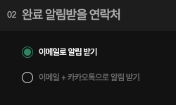
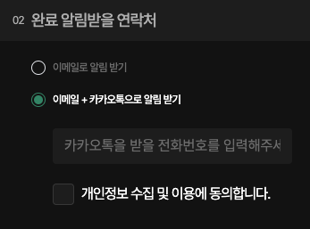
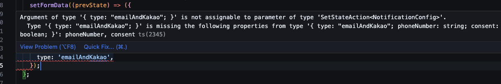

TypeScript의 Discriminated Union을 활용해서 UI 상태 안전하게 관리하기

<!--truncate-->

## 배경

최근 팀원분이 사용자의 연락처로 정보를 전달해야하는 기능을 구현하셨고, 그것을 리뷰해야했다.

그리고 팀원분께서 개발하신 UI 요구사항은 다음과 같았다.





- 이메일로 전달받기
- 이메일 + 카카오톡으로 전달 받기
  - `<input />`을 통해 전화번호를 입력 받는다.
  - `<input />`을 통해 약관 동의 여부를 입력 받는다.

개발자마다 다르겠지만, 이 요구사항을 만족하기 위한 type 또는 interface를 작성해달라고 **ChatGPT와 Claude에게 질문했고, 다음과 같이 알려주었다.**
그리고 팀원분 역시 이와 비슷한 구조를 선택하셨다.

```typescript
// 폼 데이터 인터페이스 정의
interface Form {
  phoneNumber: string;
  agreeToTerms: boolean;
}

// 폼 제출 방식 인터페이스 정의
interface FormSubmission {
  method: 'email' | 'emailAndKakao';
  data?: Form;
}
```

음... 이 interface를 통해서도 충분히 구현이 가능하기는 하다. 하지만 내 생각에는 실수하기 쉬운 구조의 interface로 보인다.

## 발생할 수 있는 문제

위 interface는 왜 실수하기 쉬운 구조인지 생각해보자.

#### 문제 1. 타입 안정성 부족:

`FormSubmission` interface는 `data`필드가 optional로 정의되어 있기 때문에 `method`가 `emailAndKakao`일 때 `data` 필드가 반드시 존재해야 한다는 것을 타입 시스템이 보장하지 못한다.

- 요구사항에 따르면, `emailAndKakao`인 경우 사용자는 반드시 전화번호와 약관동의를 체크해야한다. 하지만 위 interface는 요구사항과 다르게 `method`가 `emailAndKakao`일 때, `phoneNumber`와 `agreeToTerms` 값을 비울 수 있다.

```typescript
setFormSubmission({
  method: 'emailAndKakao',
  // 요구사항과 다르게 data 필드를 비웠음에도 오류가 발생하지 않는다.
});
```

> **_실수를 안하면 되는 거 아닌가요?_** -> 실수를 안하려고 노력하는 것보다는 "실수를 할 수 없게" 하는 것이 더 낫다고 생각한다.

#### 문제 2. 불필요한 코드 추가:

타입 시스템만으로는 충분하지 않기 때문에, 런타임 체크에 대한 코드나 유효하지 않은 상태들을 관리하기 위한 코드들이 추가된다.

이는 코드를 복잡하게 만들고, 개발자가 실수할 가능성을 높인다.

#### 문제 3. 가독성과 유지보수성 저하

`method`가 하나 더 추가 된다면?.. 아마도 조건부 렌더링과 상태 관리가 더욱 복잡해지면서 코드의 가독성과 유지보수성이 저하된다.

## 개선안: Discriminated Union을 활용하여 타입 안전하게 상태 관리하기

나는 리뷰이에게 다음과 같은 interface는 어떤지 조심스레 제안해보았다.

```typescript
type NotificationConfig =
  | {
      type: 'emailOnly';
    }
  | {
      type: 'emailAndKakao';
      phoneNumber: string;
      consent: boolean;
    };
```

왜 나는 이 interface가 더 낫다고 생각했으며, 왜 리뷰이에게 변경을 제안했을까?

#### 1. 타입 안정성:

`NotificationConfig`의 타입에 따라 필요한 필드가 자동으로 체크된다. 예를 들어, `type`이 `emailAndKakao`일 때는 `phoneNumber`와 `consent(agreeToTerms)`가 반드시 존재해야 한다고 타입 시스템이 알려준다.



#### 2.유지보수성 개선

새로운 상태나 필드를 추가하기 쉬워지며, 타입 시스템이 컴파일 시점에 에러를 잡아내므로, 런타임 에러의 가능성이 줄어든다.

## 결론

Discriminated Union을 활용한 타입 설계는 UI 상태를 더 안전하고 효율적으로 관리할 수 있게 해준다.

- 타입 안전성 향상
  - 컴파일 시점에서 많은 오류를 잡아낼 수 있어, 런타임 오류의 가능성을 크게 줄일 수 있다.
- 코드 간결성
  - 불필요한 런타임 체크를 줄일 수 있어 코드가 더 간결해진다.
  - 각 상태가 명확히 구분되어 있어, 코드의 의도를 더 쉽게 파악할 수 있다.
- 확장성
  - 새로운 상태나 필드를 추가하기 쉬워, 요구사항 변경에 유연하게 대응할 수 있다.
- 자동완성 지원
  - IDE에서 각 상태에 맞는 필드를 자동으로 제안해주어 개발 생산성을 높일 수 있다.
