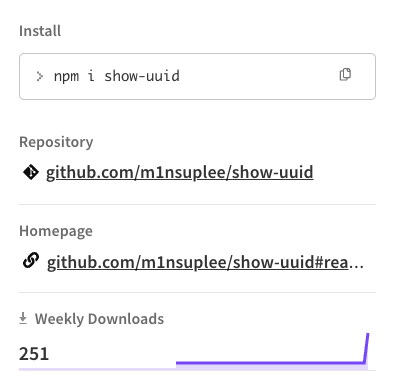

이걸 왜 다운로드 받지?!!

<!--truncate-->

### 일주일 간 다운로드 횟수 251회 달성



개발하다가 임의로 uuid를 생성해야 할 때가 종종 있는데, 웹사이트 찾아 들어가는 것도 귀찮고 해서 uuid(v4)를 생성해서 보여주는 CLI를 하나 만들어서 배포했다.

```bash
npx show-uuid
```

근데 251명이나 다운로드 했다(정작 나는 한 번 밖에 사용한 적이 없다).

그냥 재밌는 상황이라 블로그에 추억으로 남길 겸 업로드한다.
