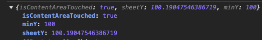

`getBoundingClientRect` 크로스 브라우징 이슈 삽질기

<!--truncate-->

## 문제


- 안드로이드 크롬에서 바텀시트 내부 컨텐츠에 스크롤이 발생하지 않는다는 제보를 받았다.

그래서 급하게 안드로이드 폰으로 테스트를 해보았다. 진짜 작동하지 않는다.

## 코드 수준에서 디버깅 해보기

### 또 CSS 문제겠지

처음에는 CSS 크로스 브라우징 이슈인 줄 알았다. 그래서 스크롤 관련 속성을 찾아가며 이것저것 건드려보며 뚝딱거려봤다.

- 몇 시간을 씨름 했는데, 안됐다.

### 바텀시트 스크롤 구현부 디버깅 해보기

구현부에서는 바텀시트 내부 content를 터치한 건지, 그 외 영역을 터치한 것인지 판단한다.

그리고 바텀시트 내부 content를 스크롤 할지 말지 결정한다.

```typescript
// 이 함수를 매 터치마다 호출하여 바텀시트를 움직일지, 또는 컨텐츠 영역을 스크롤할지를 평가
const canUserMoveBottomSheet = (): boolean => {
  const { touchMove, isContentAreaTouched } = metrics.current;

  if (!isContentAreaTouched) {
    return true;
  }

  if (sheetY !== minY) {
    return true;
  }

  if (touchMove.movingDirection === "down") {
    // 스크롤을 더 이상 올릴 것이 없다면, 바텀시트를 움직이는 것이 자연스럽습니다.
    // Safari 에서는 bounding 효과 때문에 scrollTop 이 음수가 될 수 있습니다. 따라서 0보다 작거나 같음 (<=)으로 검사합니다.
    return (contentRef.current?.scrollTop || 0) <= 0;
  }

  return false;
};
```

- 즉 바텀시트 내부 content에 스크롤이 발생하지 않는다는 것은 이 함수가 매번 `true`를 반환한다는 것을 암시한다.

그래서 Android + Chrome 환경에서 디버깅을 해보았다.

```typescript
console.log({
  isContentAreaTouched,
  minY,
  sheetY,
});
```

과연 결과는?!!...



- 😨 컨텐츠 영역을 터치한 것으로 기록은 됐지만, MacOS 크롬, iOS 사파리 크롬과 다르게 sheetY의 값이 소수점까지 발생하고 있었다. 그래서 아래 조건문에 의해 항상 `true`가 됐던 것이다.

```typescript
if (sheetY !== minY) {
  return true;
}
```

그래서 어떻게 할지 고민하다가, 아래와 같이 처리하였다.

```typescript
if (Math.abs(sheetY - minY) > 1) {
  return true;
}
```

- 아직까지는 버그 제보가 없다.
  - DOM 관련 테스트 코드는 아직도 어떻게 작성해야할지 감이 잘 안 잡힌다.

## 알게된 것

### [뇌피셜] Blink 엔진과 WebKit 엔진은 getBoundingClientRect의 반환값 차이를 보일 수 있다.

MDN에서 `getBoundingClientRect` 관련 문서들을 찾아보았는데, 렌더링 엔진에 따라 반환값 차이가 있을 수 있다는 정보를 찾을 수 없었다.

하지만 내 경험에 따르면, **Blink 엔진(안드로이드 크롬)은 소수점 단위의 픽셀값을 반환할 수 있지만, WebKit 엔진은 정수 단위로 반환할 수 있다.**

누군가 이 문제에 대한 원인을 알려준다면 참으로 고마울 것 같다.
