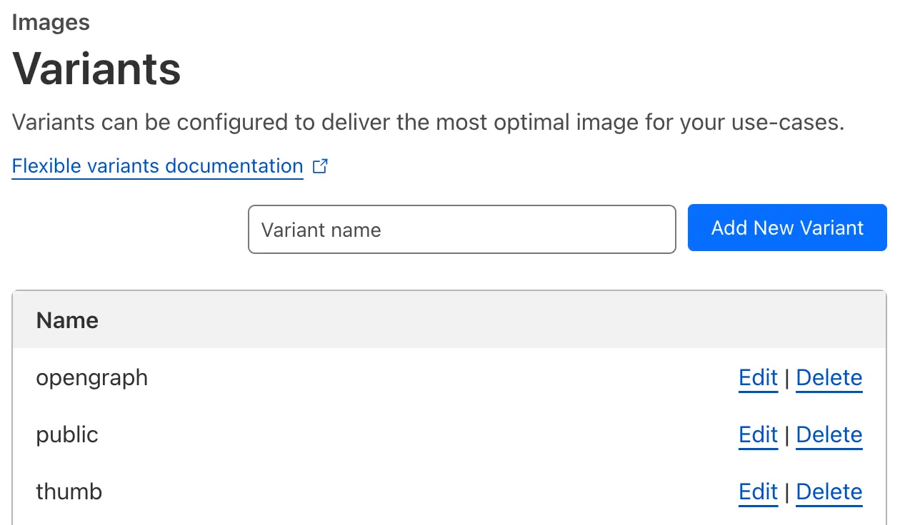
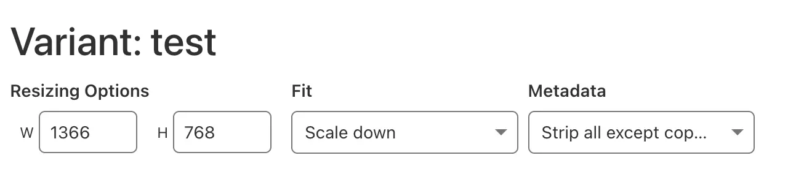
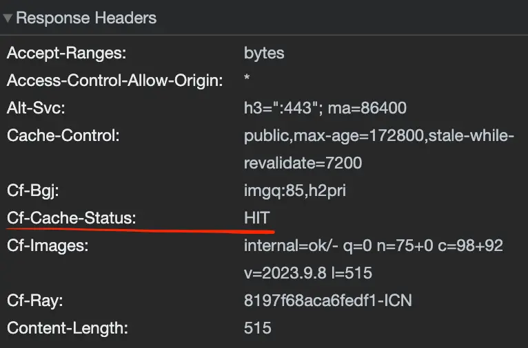

이미지 CDN 서비스를 조사하던 중 [Cloudflare Images](https://www.cloudflare.com/ko-kr/lp/pg-images/?utm_source=google&utm_medium=cpc&utm_campaign=PAYGO_MLT_ALL_G_Search_BG_EXP__DEV&utm_content=images&utm_term=cloudflare+image&campaignid=71700000114890435&adgroupid=58700008553151056&creativeid=675088711563&&_bt=675088711563&_bk=cloudflare%20image&_bm=e&_bn=g&_bg=153968973556&_placement=&_target=&_loc=1009871&_dv=c&awsearchcpc=1&gad=1&gclid=CjwKCAjwysipBhBXEiwApJOcu5KK4_JVp8Wkk-jkJXZV5Hf66DNhaaI2bg87cwbYKG6sLA7UM2WENhoCIWIQAvD_BwE&gclsrc=aw.ds)의 혜자스러운 가격과 쉬운 사용법이 마음에 들었습니다.

이미지 리사이징과 100,000개의 이미지를 $5/월로 이용할 수 있습니다.

## 이미지 리사이징 방법

UI를 통해 손쉽게 리사이징을 할 수 있습니다.
아래 사진에 보이는 것과 같이 왼쪽 사이드바 UI의 `Images` 탭을 선택하고, `Variants`를 선택합니다.


그럼 아래와 같은 화면이 나오고, `Add New Variant`를 클릭해줍니다.



그러고나면 아래와 같은 화면이 나오는데 여기서 이미지 리사이징을 해주면 됩니다.

하나의 이미지에 대해 모바일, 데스크탑, 요소의 크기 등을 고려하여 이미지 사이즈를 최적화 할 수 있습니다!

저는 새로운 Variant의 이름을 `test`로 지어주었습니다.



W, H는 당연히 너비와 높이를 나타냅니다.

`Fit`에는 총 5가지 옵션이 있는데, 아마 웹 개발자라면 이름만 보아도 무엇을 의미하는지 알 수 있을 것입니다.

- `Scale Down`: 주어진 너비 또는 높이 안에 완전히 맞추기 위해 이미지 크기가 축소되며, 확대되지는 않습니다.
- `Contain`: 최대한 크게 보여주되 잘리는 부분이 없고 동일한 비율을 유지합니다.
- `Cover`: 최대한 크게 보여줍니다. 이미지가 잘리는 부분이 생길 수도 있는 옵션입니다.
- `Drop`: 주어진 너비와 높이에 맞추기 위해 축소되거나 잘리는 부분이 생길 수 있습니다. 주어진 크기보다 작은 이미지의 경우 `Scale Down`처럼 동작하고, 주어진 크기보다 큰 이미지의 경우 `Cover`처럼 동작합니다.
- `Pad`: 이미지가 주어진 너비와 높이보다 작을 경우, 남은 공간을 검정색으로 채웁니다.

일부 이미지에는 카메라 설정, 위치 정보 등 메타데이터가 포함될 수 있습니다. 이러한 정보는 이미지 로딩 시간에 영향을 줄 수 있습니다.

`Metadata` 옵션은 총 3가지가 있고, 저의 경우는 항상 `Strip all metadata` 옵션을 사용했습니다.

- `Strip all metadata`: 메타데이터를 모두 제거
- `Strip all except copyright`: 저작권 데이터를 제외하고 모두 제거
- `Keep all metadata`: 모든 메타데이터 유지

## 브라우저에서 이미지 가져오기

간단합니다. 호스트네임은 https://imagedelivery.net 입니다.
그리고 이렇게 요청하면 됩니다.

```text
https://imagedelivery.net/<ACCOUNT_HASH>/<IMAGE_ID>/<VARIANT>
```

- ACCOUNT_HASH: `Overview` 탭을 누르면 나오는 페이지에서 확인할 수 있습니다.
- IMAGE_ID: 업로드를 통해 생성된 ID입니다.
- VARIANT: `Variants` 탭에서 생성한 이미지 리사이징 옵션입니다.

실제 요청은 이렇게 할 수 있습니다. 가장 마지막 path parameter인 `<VARIANT>` 자리에 아까 새로 생성해준 variant인 `test`를 넣어줍니다.

```html
/<업로드를 통해 생성된 이미지 ID>/test"
  alt="..."
/>
```

그럼 이렇게 클라우드플레어 CDN에 캐시가 됩니다! 상황에 따라 다를 수 있겠지만, 사용자는 더 빨리 이미지를 제공 받을 수 있게 될 것 입니다.


## LQIP 만들기

`LQIP`는 Low Quality Image Placeholder의 약자로 말 그대로 저화질 이미지를 플레이스홀더로 사용하는 것입니다.
저의 경우는 아래와 같이 LQIP에 대한 옵션을 설정했습니다.


원본 이미지(33.7KB) -> LQIP(588B)로 줄이며, 거의 60배에 가깝게 줄어든 것을 확인할 수 있습니다.


**_하지만 지금 이 글과 다르게 원본 이미지를 더 최적화해야 할 것입니다(webp로의 변환 등)._**

## LQIP 적용하기

간단합니다. 원본 이미지를 참조하는 ``요소의 부모가 LQIP 이미지를 참조하게 하면 됩니다.

그럼 당연히 용량이 훨씬 낮은 LQIP가 먼저 다운로드 되면서 화면에 먼저 보여지게 되고, 그 이후에 원본 이미지가 보여지게 됨으로써 더 나은 사용자 경험을 제공할 수 있습니다.

```html
<div
  id="lqip"
  style={{
    backgroundImage: url("https://imagedelivery.net/<ACCOUNT_HASH>/<업로드를 통해 생성된 이미지 ID>/lqip"),
    backgroundSize: 'cover',
  }}
>
  /<업로드를 통해 생성된 이미지 ID>/test"
    alt="..."
  />
</div>
```
