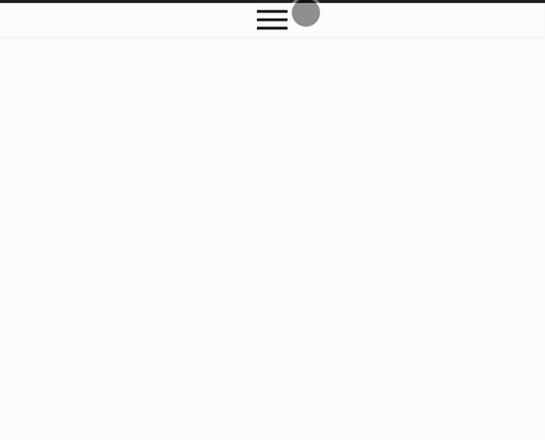
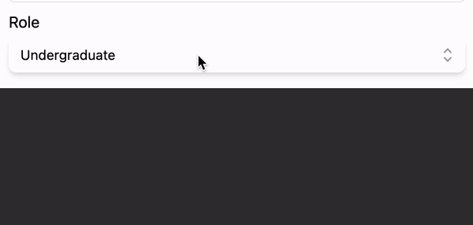

이 글은 헤드리스 컴포넌트를 소개하는 것에만 관심을 두고있다.

## 헤드리스 컴포넌트?!🤔

헤드리스 컴포넌트는 **디자인**을 포함하지 않는다.
하지만, 기능은 존재하는 컴포넌트가 바로 **헤드리스 컴포넌트**다.
이는 곧 스타일링(디자인)에 대한 관심사를 분리할 수 있음을 의미하기도 한다.

## 근데 왜 헤드리스 컴포넌트를 쓸까?

UI에 대한 디자인은 당시의 기획과 다르게 변경되기 마련이다.
그리고 새로운 요구사항은 과거에 개발한 컴포넌트를 변경해야함을 의미하고, 이는 **Side Effect**를 초래할 수 있다.

그래서 나 역시 컴포넌트가 다가올 미래에 변경될 수 있음을 인지하고, 변경에 유연한 컴포넌트를 개발해야한다는 것도 잘 알고 있다.

그리고 헤드리스 컴포넌트는 기능에만 집중함으로써 디자인 변경에 유연하게 대응할 수 있다.

### 예를 들어보겠습니다!

어느날, 요구사항에 따라 아래와 같은 UI를 개발했다!


그런데 또 다른 어느날, 아래와 같은 UI를 개발하달라고 한다...!


우리들 눈에는 분명 위 UI와 공통된 로직을 갖고 있음이 분명하다.
버튼을 누르면 메뉴들이 나와야하는 로직이 공통된다.

그런데 UI에 대한 디자인이 너무나도 다르다. 어떤 선택을 해야할까?
헤드리스 컴포넌트를 알기 이전의 나는 이런 생각을 가장 먼저 했다.

- 기존에 개발된 컴포넌트에게 스타일링과 관련된 `prop`을 전달하여 분기 처리하기.

그런데 이 방법은 또 다른 `side effect`를 불러일으키기 마련이다.
하지만 헤드리스 컴포넌트와 함께라면 두려울 것이 없다!

## 헤드리스 컴포넌트로 대응하기!🔥

`tailwindcss`를 개발한 **Tailwind Labs**에서 개발한 `Headless UI`에서 제공하는 `Menu` 컴포넌트를 통해 헤드리스 컴포넌트의 강력함을 알아보자!

`Menu` 컴포넌트는 아래와 같이 `Menu.Button`, `Menu,.Items`, `Menu.Item`과 함께 구성된다.

```typescript
import { Menu } from '@headlessui/react';

function MyDropdown() {
  return (
    <Menu>
      <Menu.Button>More</Menu.Button>
      <Menu.Items>
        <Menu.Item>
          {({ active }: { active: boolean }) => (
            <a
              className={`${active && 'bg-blue-500'}`}
              href="/account-settings"
            >
              Account settings
            </a>
          )}
        </Menu.Item>
        <Menu.Item>
          {({ active }: { active: boolean }) => (
            <a
              className={`${active && 'bg-blue-500'}`}
              href="/account-settings"
            >
              Documentation
            </a>
          )}
        </Menu.Item>
        <Menu.Item disabled>
          <span className="opacity-75">Invite a friend (coming soon!)</span>
        </Menu.Item>
      </Menu.Items>
    </Menu>
  );
}
```

그리고 `Menu.Button` 컴포넌트에 클릭 이벤트가 발생하면, `Menu.Items`가 open/close가 된다.
즉 Dropdown UI의 핵심인 버튼을 누르면, 메뉴 목록이 나타난다는 핵심 로직에만 집중한 컴포넌트인 것이다.
이를 통해 **Headless**한 컴포넌트를 사용하는 사용자는 UI에 대한 디자인에만 관심을 둘 수 있게 되면서 똑같은 로직을 다시 작성할 필요없이 스타일링에만 관심사를 두고 사용할 수 있게 됐다.

나는 헤드리스 컴포넌트를 처음 접했을 때, 참 매력적인 컴포넌트 설계 방식이라고 생각했다.
그리고 나의 경우, 헤드리스 컴포넌트 사용을 통해 컴포넌트 재사용의 관점을 UI가 아닌 **로직**에 두게 됐다.

그리고 헤드리스 컴포넌트를 통해 변경과 확장에 유연한 애플리케이션을 개발할 수 있을 것이라고 기대한다.
